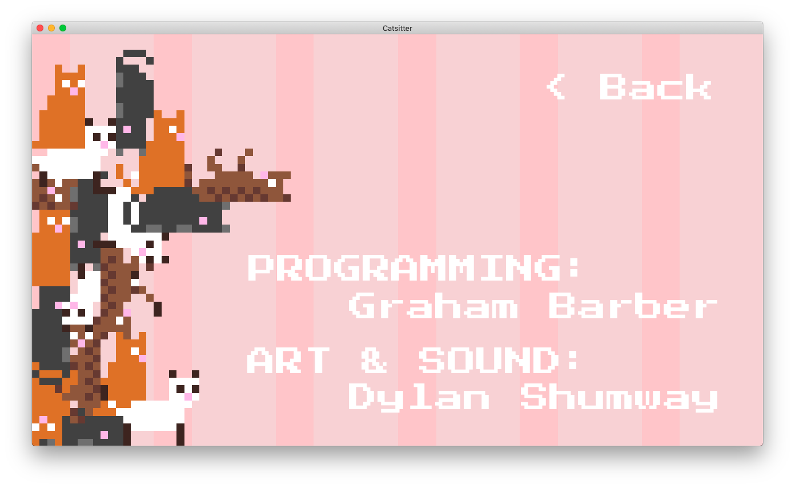

# Catsitter

> Sit cats like a professional

## Premise

Fit as many cats as you can on your bed so that you can make money, buy a bigger bed, and then fit more cats. Don’t let any of them fall off, though!

Ships with 100% genuine cat physics.

Created for Ludum Dare 42.

## Controls

- Mouse: Drag and drop cats from your dresser to the ever-growing pile on your bed.
- Escape: Go back to the main menu to view your high score.

## Tooling

- Programmed in **Godot Engine**
- Sounds created in **Sunvox**
- Art created with **Aseprite** and **Photoshop**

## Screenshots

